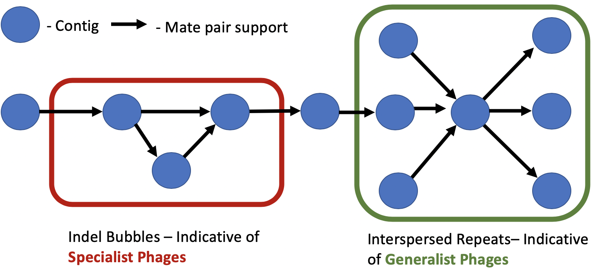
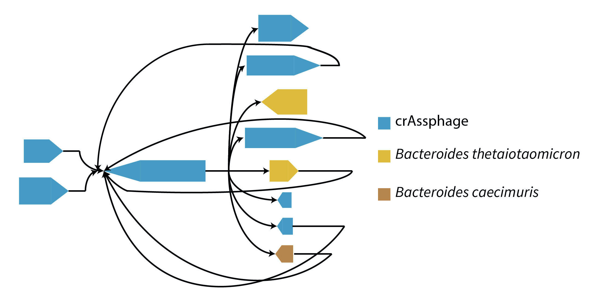
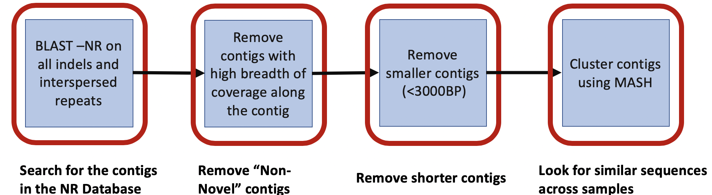
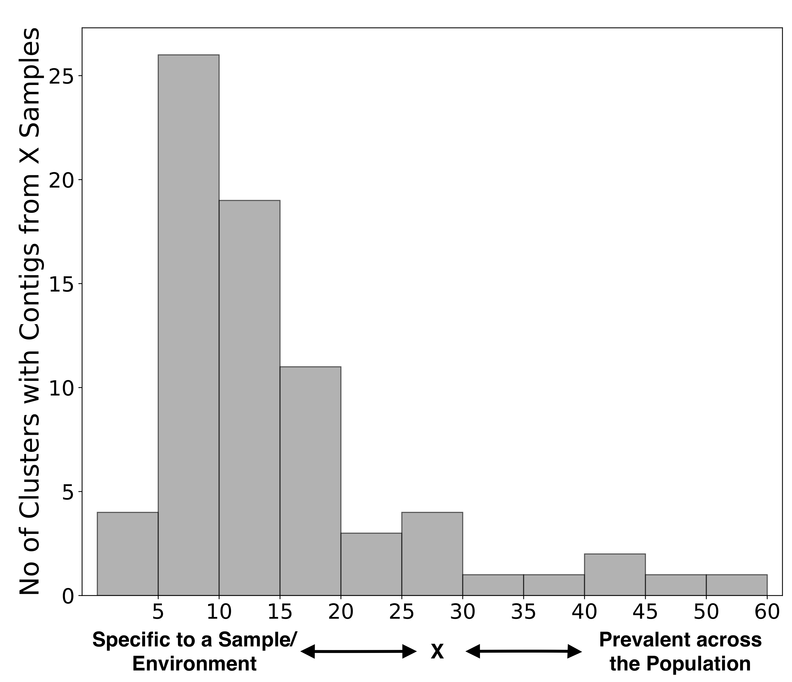
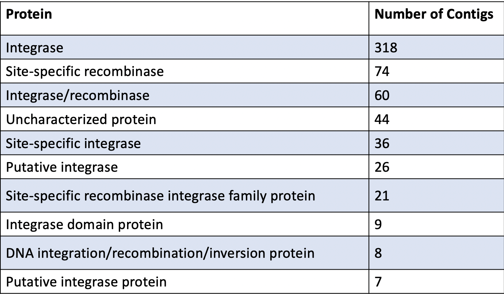

<h1> PIRATE-Phage Identification fRom Assembly-graph varianT Elements </h1>

The discovery of antibiotics was an important milestone in advancement of modern medical science and has become an important aspect of healthcare, veterinary and agricultural industries. However, antimicrobial resistance, where the bacteria evolve rapidly to defeat drugs designed to kill them, is on the rise. Bacteriophages, viruses that infect and kill bacteria, are increasingly being explored as alternatives or complements to antibiotics.  Phages have several advantages, including but not limited to, their host specificity, allowing them to target one organism rather than wiping out entire microbial communities, their ability to self replicate, and their ability to degrade biofilms which also reduce the efficacy of antibiotics. The effectiveness of phage therapy critically relies on the availability of a collection of phages able to infect the pathogens being targeted. Despite recent, substantial progress, the discovery of novel phages remains highly laborious. 


Whole metagenomic shotgun sequencing datasets of mixed microbial community samples can be utilized to identify previously uncharacterized phages; it is estimated that up to 17% of the microbial DNA recovered from human stool samples comes from phage and a recent study of 70 animal microbiomes resulted in discovery of over 2,500 circular viral genomes. While sequencing data could substantially expand the number of phages available for phage therapy applications, identifying novel phage in these datasets is computationally difficult. Unlike prokaryotes and eukaryotes, which contain the phylogenetically informative 16S and 18S rRNA marker genes, respectively, viruses lack a single universal marker gene. Furthermore, phage genomes are significantly smaller than bacterial or fungal genomes, limiting their yield in whole metagenomic shotgun sequencing data. Existing bioinformatics tools for detecting phage from complex, fragmented metagenomes are optimized for longer contigs greater than 2 kb and often rely on homology to known viral references. Because it is difficult to isolate and characterize phage, these viral references are often limited and sparse.


In this study, we show that a subset of structural variants discovered in assembly graphs contain phage-like genomic elements. We applied MetaCarvel1, a tool developed in our lab for de novo scaffolding and reference independent variant discovery in metagenomic shotgun sequencing datasets, to 208 stool samples from the Human Microbiome Project (HMP)2. MetaCarvel constructs directed assembly graphs, where nodes represent unitigs, sequences that can be unambiguously reconstructed from the sequencing reads, while the edges indicate that the unitigs are adjacent in one or more  organisms in the sample. The adjacency information is inferred either through sequence overlap information or through paired-end read information. 

 

We observed contigs with phage elements in insertion-deletion (indel bubbles) and interspersed repeat variants detected by MetaCarvel. An indel bubble occurs when one path through the assembly graph contains the source and sink contigs, while other paths contain additional contigs that could indicate insertion or deletion events in a genome. Interspersed repeats manifest as high centrality nodes consisting of a single contig flanked by multiple different contigs. We believe that indel events could represent host-specific phage that integrate into certain genomes of a single species or strain, while interspersed repeats could represent phage genomes that are shared by many host species. 


We aligned the contigs identified from predicted structural variants to crAssphage, a 97kb circular phage that was computationally identified and is prevalent in human fecal samples4. A third of the contigs aligning to crAssphage were found in the predicted interspersed repeats and 18% of these contigs were found in indel bubbles predicted by MetaCarvel. This suggests that MetaCarvel structural variants could be used to identify potentially novel phage. In the adjoining figure we show a crAssphage element found in an interspersed repeat, 

 


To search for novel phages, we collected contigs belonging to bubbles and repeats within the 208 HMP stool samples. We then aligned these contigs against the NCBI non-redundant database and limited our focus  to 78,147 contigs greater than 3kbp that had no confident matches, and thus are potentially novel microbes. .We used MASH to group together the filtered contigs that had  similar sequence composition. The schematic pipeline is described below:

 

This clustering step was intended to identify genomic segments that reoccur across samples, and are, therefore, less likely to be artifactual. We identified 624 non-singleton clusters in total. Within these clusters, 90 clusters comprising 1,800 contigs were rich in genes associated with phage/prophage. Absence of known phage genes in the other 534 clusters do not confirm the non existence of novel phage elements especially because the known phage gene databases are sparse. 

<table>
    <tr>
        <td> 
            
            <figcaption>Histogram of phages specific and prevalent across the environment.</figcaption> 
        </td>
        <td>   
        </td>
        <td> 
             
            <center>
            <figcaption>Analysis of Cluster-50</figcaption>
            <center>
        </td>
    </tr>
</table>


We have demonstrated that certain motifs within assembly graphs are enriched for phage-like genomic elements.  Our initial analysis focused on just a few simple graph motifs, however we are currently exploring more complex patterns that may reveal not only novel phage but also information about the population structure of the phage within microbial communities. 

<h2>References</h2>


1. Ghurye, J., Treangen, T., Fedarko, M., Hervey, W. J., 4th & Pop, M. MetaCarvel: linking assembly graph motifs to biological variants. Genome Biol. 20, 174 (2019).

2. Consortium, T. H. M. P. & The Human Microbiome Project Consortium. Structure, function and diversity of the healthy human microbiome. Nature vol. 486 207–214 (2012).

3. Ondov, B. D. et al. Mash: fast genome and metagenome distance estimation using MinHash. Genome Biology vol. 17 (2016).

4. Edwards, R. A. et al. Global phylogeography and ancient evolution of the widespread human gut           virus crAssphage. Nat Microbiol 4, 1727–1736 (2019).


```python

```
