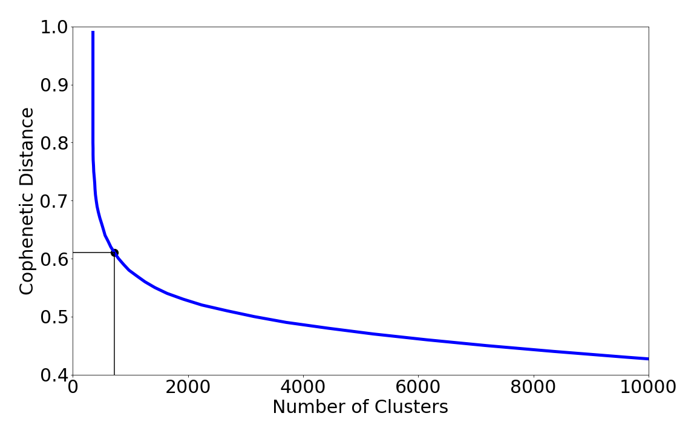

<h1>Validating Clusters</h1>

To validate clusters we download genes from the Uniprot database using the search keywords 'Phage' and 'integrase genes'. 

We blast them against the contigs using the BLASTX program. 

Most of the scripts in the directory is to understand the various clusters and exploratory in nature. 

For the 208 stool samples from the HMP dataset, we performed the above experiments and we spotted about 80000 contigs in 725 clusters. Of the 725 clusters 624 were non singleton and spotted about 99 clusters with 1500 contigs containing novel phages in them. 

<table>
    <tr>
        <td> 
            
            <center><figcaption>Identifying the number of clusters.</figcaption><center>
        </td>
        <td>   
        </td>
        <td> 
             
            <center><figcaption>Analysis of Cluster-50</figcaption><center>
        </td>
    </tr>
</table>


```python

```
